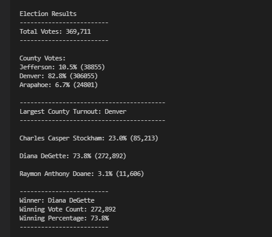

# Election_Analysis

## Overview of Election Audit: 

The purpose of the election audit is to identify how many candidates participated in the elecetion commission, what their voting counts were and how many votes did each candidate get.  The analysis also identified which candidate won in in the elections and which county has the largest number of votes.

https://github.com/shantaljambotkar/Election--Analysis

## Election-Audit Results: 

Using a bulleted list, address the following election outcomes. Use images or examples of your code as support where necessary.

How many votes were cast in this congressional election?

* Total Number of votes that were casted in the congressional election

Provide a breakdown of the number of votes and the percentage of total votes for each county in the precinct.

* Number of votes and percentage of votes:

Which county had the largest number of votes?

* Denver had the largest number of votes

Provide a breakdown of the number of votes and the percentage of the total votes each candidate received.

* Breakdown of votes per candidate 

Which candidate won the election, what was their vote count, and what was their percentage of the total votes?

* Winning Candidate

* Final Results:

## Election-Audit Summary: 

In a summary statement, provide a business proposal to the election commission on how this script can be used—with some modifications—for any election. Give at least two examples of how this script can be modified to be used for other elections.

The script that is created is to run an analysis on the election commision for 3 counties with 3 candidates.  The script will help in identifying which candidate won, with their winning percentages along with winning county.  All the numbers and details are stored a file which can be shared and distributed.

You can use this script for any number of candidates and counties by:

    1.  Making changes to the elections_results.csv file.  
            (I) In this file you can add as many candidates as you can and the script will help you in idetifying the winner.
            (II) You can also add more details to the candidates - like age, sex, etc.

    2.  This script can be used on a larger scale like state elections again, by adding the information required to the elections_results.csv file.